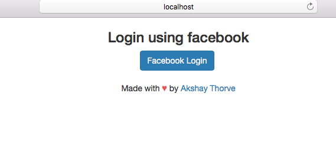
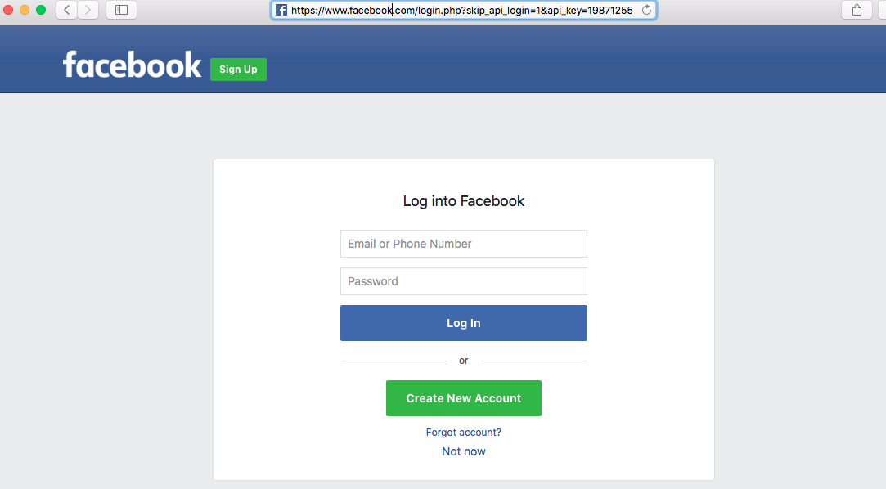
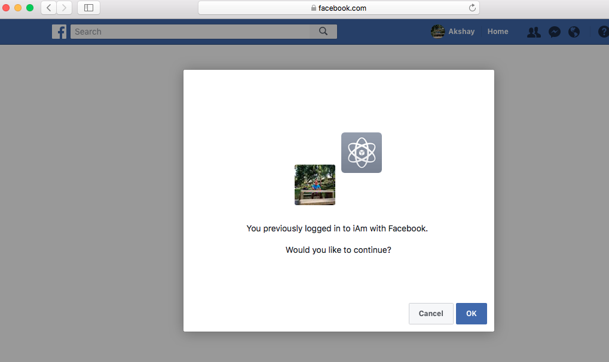
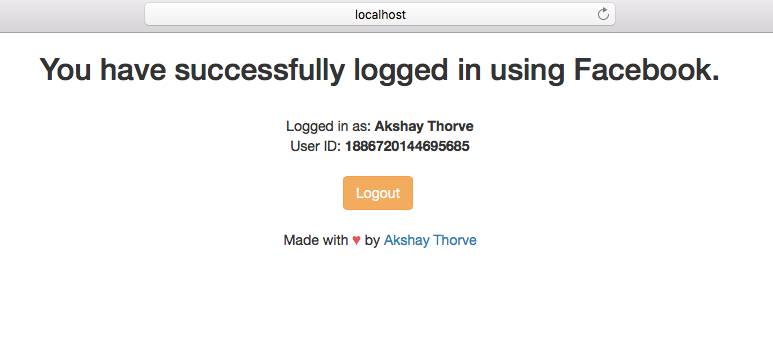

# Facebook Oauth2 login using Spring Boot

Simple Facebook OAuth 2 authentication application with Login and Logout. This app can be intigrated with any Java, Spring or backend framework. You can extend this as per your needs.   

## Spring Boot, OAuth2 Authentication, Facebook API


## Requirements

1.  Java - 1.8.x

2.  Maven - 3.x.x

3.  Spring 5, Spring Boot

4.  Facebook developer App


## Steps to Setup

** 1. Clone the application repo **

** 2. Change application.yml file  **
 Change file with your clientId and clientSecret.

** 3. Build and run the backend app using maven**

```bash
mvn spring-boot:run
```
The application will start at <http://localhost:8080>.

## Snapshots

```
Landing page
```


```
Facebook API RESTful call
```


```
API authentication on Facebook
```


```
Callback to base URL after successful authentication
```


Feel free to use the code.


